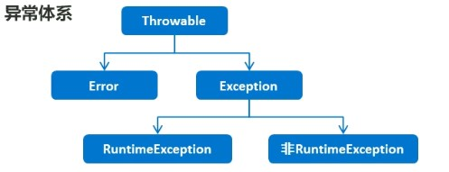

## 1.0. 异常



Error：严重问题，不需要处理

Exception：异常类，表示程序本身可以处理的问题

	-  RuntimeException：在编译期是不检查的，出现问题后，需要我们回来修改代码
	-  非RuntimeException：编译期就必须处理的，否则程序不能通过编译，就更不能正常运行了

## 1.1 JVM的默认处理方案

如果程序出现了问题，我们没有做任何处理，最终JVM会做默认的处理

- 把异常的名称，异常原因和异常出现的位置等信息输出在控制台
- 程序停止执行

```java
/*
Exception in thread "main" java.lang.ArrayIndexOutOfBoundsException: Index 3 out of bounds for 		length 3
at com.test00.ExceptionDemo.method(ExceptionDemo.java:12)
at com.test00.ExceptionDemo.main(ExceptionDemo.java:6)
 */
```


	## 1.2 异常处理

- try ... catch ...
- throws

#### 1.2.1 try...catch

```java
try{
	可能出现是异常代码;
}catch(异常类名 变量名){
	异常的处理代码;
}
```

执行流程：

程序从try语句开始执行

出现异常，会自动生成一个异常类对象，该异常对象被提交给Java运行时系统

Java运行时系统接收到异常对象后，回到catch中查找匹配的异常类，找到后进行异常的处理

执行完毕后，程序可以继续往下执行

```java
public static void main(String[] args) {
    System.out.println("start");
    method();
    System.out.println("end");
}

public static void method(){
    try{
    int [] arr = {1, 2, 3};
    System.out.println(arr[3]);//new ArrayIndexOutOfBoundsException();
    }catch(ArrayIndexOutOfBoundsException e){
        //System.out.println("访问的数组索引不存在");
        e.printStackTrace();
    }
}
```


结果：

> start
> end
> java.lang.ArrayIndexOutOfBoundsException: Index 3 out of bounds for length 3
> 	at com.test00.ExceptionDemo.method(ExceptionDemo.java:13)
> 	at com.test00.ExceptionDemo.main(ExceptionDemo.java:6)

#### 1.2.2 Thowable的成员方法

| 方法名                          | 说明                            |
| ------------------------------- | ------------------------------- |
| `public String getMessage()`    | 返回此throwable的详细消息字符串 |
| `public String toString()`      | 返回此可抛出的简短描述          |
| `public void printStackTrace()` | 把异常的错误信息输出在控制台    |


#### 1.2.3 编译时异常和运行时异常的区别

Java中的异常分为：编译时异常和运行时异常，也被称为受检异常和非受检异常

所有的RuntimeException类及其子类都是运行时异常，其他的异常为编译时异常

- 编译时异常：必须显示处理，否则程序会发生错误，无法通过编译
- 运行时异常：无需显示处理，也可以和编译时异常一样处理

```java
public static void main(String[] args) {
    //method();
    method01();
}

//编译时异常
public static void method(){
    try {
        String s = "2049--12--12";
        SimpleDateFormat sdf = new SimpleDateFormat("yyyy--MM--dd");
        Date date = sdf.parse(s);//java: 未报告的异常错误java.text.ParseException; 必须对其进行捕获或声明以便抛出
        System.out.println(date);
    }catch(ParseException e){
        e.printStackTrace();
    }
}

//运行时异常 这里做不做try catch 都是一样的都要到这里报错的地方修改程序
public static void method01(){
    try {
        int[] arr = {1, 2, 3};
        System.out.println(arr[3]);//ArrayIndexOutOfBoundsException
    }catch(ArrayIndexOutOfBoundsException e){
        e.printStackTrace();
    }
}
```


#### 1.2.4 throws

格式：

```throws 异常类名;```

```java
public static void method01() throws ArrayIndexOutOfBoundsException{
        int[] arr = {1, 2, 3};
        System.out.println(arr[3]);//ArrayIndexOutOfBoundsException
    }
```

- 编译时异常必须要进行处理，两种处理方案：try...catch或者throws，如果采用throws这种方案，将来谁调用谁处理

- 运行时异常可以不处理，出现这种问题，需要我们回来修改代码

## 1.3 自定义异常

格式：

```java
public class 异常类名 extends Exception{
    无参构造;
    有参构造;
}
```

```java
public class ScoreException extends Exception{
    //无参构造
    public ScoreException(){}
    //有参构造，message为提示异常的信息
    public ScoreException(String message){
        super(message);
    }
}
```

```java
public class Teacher {
    public void checkError(int score)throws Exception{
        if(score < 0 || score > 100)
            //throw new ScoreException();
            throw new ScoreException("给的分数有误，应该在0-100间");
        else
            System.out.println("输出正确");
        }
}
```

```java
public class TestDemo {
    public static void main(String[] args) {
        Scanner sc = new Scanner(System.in);
        System.out.println("请输入分数");
        int score = sc.nextInt();
        Teacher t = new Teacher();
        try {
            t.checkError(score);
        } catch (Exception e) {
            e.printStackTrace();
        }
    }
}
```

> 请输入分数
> 120
> com.test01.ScoreException: 给的分数有误，应该在0-100间
> 	at com.test01.Teacher.checkError(Teacher.java:7)
> 	at com.test01.TestDemo.main(TestDemo.java:12)


**throws 和 throw 的区别**

- throws
  - 用在方法声明的后面，跟的时异常类名
  - 表示抛出异常，由该方法的调用者来处理
  - 表示出现异常的一种可能性，并不一定会发生
- throw
  - 用在方法体内，跟的是异常对象名
  - 表示抛出异常，由方法体内的语句处理
  - 执行throw一定抛出了某种异常

