## 1. Collection🍕

### 1.1 集合知识回顾

集合类的特点： 提供了一种存储空间可变的存储模型，存储的数据的容量可以随时发生改变


### 1.2 Collection 集合概述和使用

- 是单例集合的顶层接口，它表示一组对象，这些对象也称为Collection的元素
- JDK不提供此接口的仁和直接实现，它提供更具体的子接口（如Set和List）实现


**创建Collection集合的对象**

- 多态的方式
- 具体的实现类ArrayList

```java
//创建Collection集合的对象
//多态的方式 ArrayList()
Collection<String> c = new ArrayList<String>();
//集合里添加元素  boolean add(E e)
c.add("hello");
c.add("world");
System.out.println(c);
```

>[hello, world]

### 1.3 Collection集合常用方法

| 方法名                     | 说明                             |
| -------------------------- | -------------------------------- |
| boolean add(E e)           | 添加元素                         |
| boolean remove(Object o)   | 从集合中移除指定的元素           |
| void clear()               | 清空集合中的元素                 |
| boolean contains(Object o) | 判断集合中是否存在指定的元素     |
| boolean isEmpty()          | 判断集合是否为空                 |
| int size()                 | 集合长度，也就是集合中元素的个数 |


### 1.4 Collection 集合的遍历

Iterator：迭代器，集合的专用遍历方式

- Iterator<E> iterator()：返回此集合中元素的迭代器，通过集合的iterator()方法得到
- 迭代器是通过集合的iterator()方法得到的，所以我们说它是依赖于集合而存在

Iterator中常用的方法

- E next()：返回迭代的下一个元素
- boolean hasNext()：如果迭代具有更多的元素，则返回true

```java
/*
1. 通过集合的方法获取迭代器
2. hasNext方法判断集合是否有元素
3. next方法获取元素 遍历集合 输出在控制台
*/
//Iterator<E> iterator();返回此集合中元素的迭代器，通过集合的iterator()方法得到
Iterator<String> it = c.iterator();
/* Iterator中常用的方法
        E next();返回迭代中的下一个元素
        boolean hasNext();如果迭代具有多个元素，则返回true
*/
/*
        System.out.println(it.hasNext());
        System.out.println(it.next());
        System.out.println(it.next());
        System.out.println(it.hasNext());
        */
/*
        if(it.hasNext()){//判断有没有元素
            System.out.println(it.next());
        }
         */
while(it.hasNext()){
    //System.out.println(it.next());
    String s = it.next();
    System.out.println(s);
}
```


### 1.5 集合的使用步骤

**步骤1**：创建集合对象

**步骤2**：添加元素

​	**步骤2.1**：创建元素

​	**步骤2.2**：添加元素到集合

​	**合并**：直接添加元素到集合

**步骤3**：遍历集合

​	步骤3.1：通过集合对象获取迭代器对象

​	步骤3.2：通过迭代器对象的hasNext()方法判断是否还有元素

​	步骤3.3：通过迭代器对象的next()方法获取下一个元素

```java
Collection<String> c = new ArrayList<String>();//步骤1：创建集合对象
String s = "Hello";//步骤2.1：创建元素
c.add(s);//步骤2.2：添加元素到集合
c.add("World");//合并：直接添加元素到集合

Iterator<String> i = c.iterator();//步骤3.1：通过集合对象获取迭代器对象
while(i.hasNext()){//步骤3.2：通过迭代器对象的hasNext()方法判断是否还有元素
    String ss = i.next();
    System.out.println(ss);//步骤3.3：通过迭代器对象的next()方法获取下一个元素
}
```

### 1.6 Collection集合存储学生对象并遍历

**需求**：创建一个存储学生对象的集合，存储3个学生对象，使用程序实现在控制台遍历该集合

**思路：**

1. 定义学生类
2. 创建Collection集合对象
3. 创建学生对象
4. 把学生添加到集合
5. 遍历集合（迭代器的方法）

```java
//创建Collection集合对象
Collection<Student> student = new ArrayList<Student>();
//创建学生对象
Student s1 = new Student("jerry",11);
Student s2 = new Student("Mark", 12);
//把学生对象添加到集合
student.add(s1);
student.add(s2);
//使用迭代器遍历集合
Iterator<Student> i = student.iterator();
while(i.hasNext()){
    Student tmp = i.next();
    System.out.println(tmp.getName() + ": " + tmp.getAge());
}
```

> jerry: 11
> Mark: 12

## 2. List🍔

### 2.1 List集合概述和特点

**概述：**

- 有序集合（序列），用户可以控制列表中的每个元素的插入位置。也可以根据索引访问元素，搜索列表中的元素
- 与Set集合不同，列表通常允许重复的元素

**特点：**

- 有序：存储和取出的元素顺序一致
- 可重复：存储的元素可以重复

```java
//创建List集合对象
List<String> list = new ArrayList<String>();
//添加元素
list.add("hello");
list.add("world");
list.add("hello");
System.out.println(list);
//迭代器遍历
Iterator<String> it = list.iterator();
while(it.hasNext()){
    String s = it.next();
    System.out.println(s);
}
```

### 2.2 List集合特有方法

| 方法名                       | 说明                                   |
| ---------------------------- | -------------------------------------- |
| void add(int idx, E element) | 在集合中的指定位置插入指定的元素       |
| E remove(int idx)            | 删除指定索引处的元素，返回被删除的元素 |
| E set(int idx, E element)    | 修改指定索引处的元素，返回被修改的元素 |
| E get(int idx)               | 返回指定索引处的元素                   |

### 2.3 List集合存储学生对象并遍历

**需求**：创建一个存储学生对象的集合，存储3个学生对象，使用程序实现在控制台遍历该集合

**思路：**

1. 定义学生类
2. 创建List集合对象
3. 创建学生对象
4. 把学生添加到集合
5. 遍历集合（迭代器和for循环的方法）

```java
List<Student> studentList = new ArrayList<Student>();
Student s1 = new Student("Mark", 11);
Student s2 = new Student("Jerry", 12);

studentList.add(s1);
studentList.add(s2);

Iterator<Student> st = studentList.iterator();
while(st.hasNext()){
    Student s = st.next();
    System.out.println(s.getAge() + s.getName());
}

for (int i = 0; i < studentList.size(); i++) {
    System.out.println(studentList.get(i).getAge() + studentList.get(i).getName());
}
```

### 2.3 并发修改异常

**ConcurrentModificationException**

**产生原因：**

- 迭代器遍历的过程中，通过集合对象修改了集合中元素的长度，造成了迭代器获取元素中判断预期修改值和实际修改值不一致

**解决方案：**

- 用for循环遍历，然后用集合对象做对应的操作即可

### 2.4 ListIterator

列表迭代器

- 通过List集合的ListIterator()方法得到，所以说它是List集合特有的迭代器
- 允许沿任一方向遍历列表的列表迭代器，在迭代期间可以修改列表，并获得列表中迭代器的当前位置

ListIterator中的常用方法：

| 常用方法               | 说明                                             |
| ---------------------- | ------------------------------------------------ |
| E next():              | 返回迭代中的下一个元素                           |
| boolean hasNext():     | 如果迭代器具有更多的元素，则返回true             |
| E previous():          | 返回列表中的上一个元素                           |
| boolean hasPrevious(): | 如果迭代器在反向遍历时还有更多的元素，则返回true |
| void add(E e):         | 将指定元素插入到列表                             |

### 2.5 增强for循环

目的： 简化数组和Collection集合的遍历

格式：

```java
for(元素数据类型 变量名:数组或者Collection集合){
    //
}
```

```java
int[] arr = {1, 2, 3, 6};
for(int i: arr){
    System.out.println(i);
}

List<String> list = new ArrayList<String>();
list.add("hello");
list.add("world");
for(String s:list){
    System.out.println(s);
}
```

### 2.6 数据结构

数据结构是计算机存储和组织数据的方式。

是指相互之间存在一种或多种特定关系的数据元素的集合。

通常情况下，精心选择的数据结构可以带来更高的运行或者存储效率

#### 1. 栈和队列

**栈是先进后出的模型** 

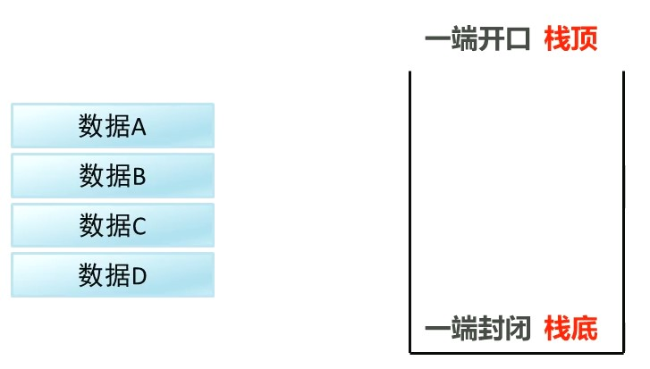

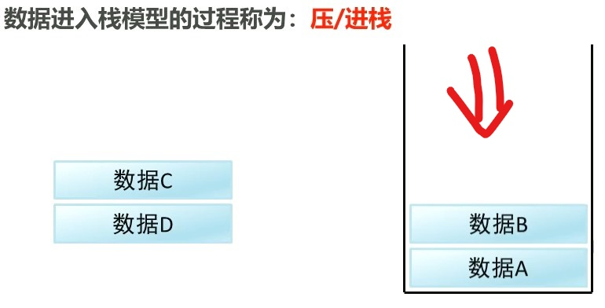

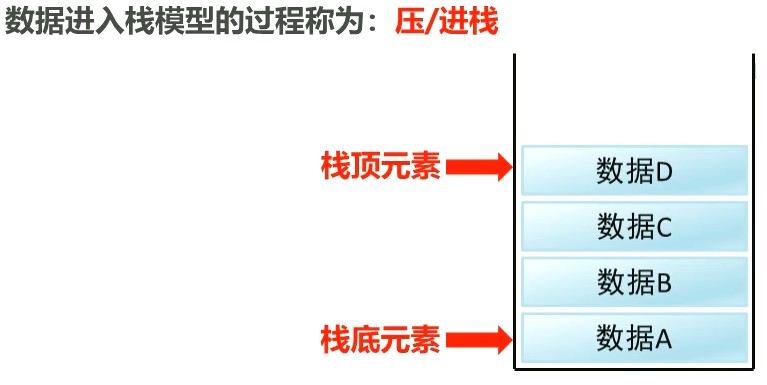

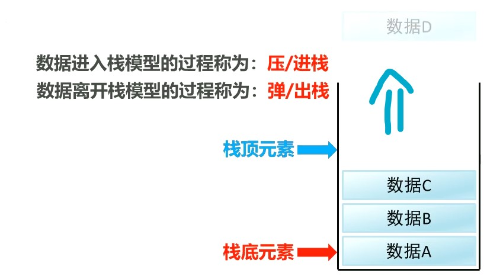


**队列是先进先出的模型**

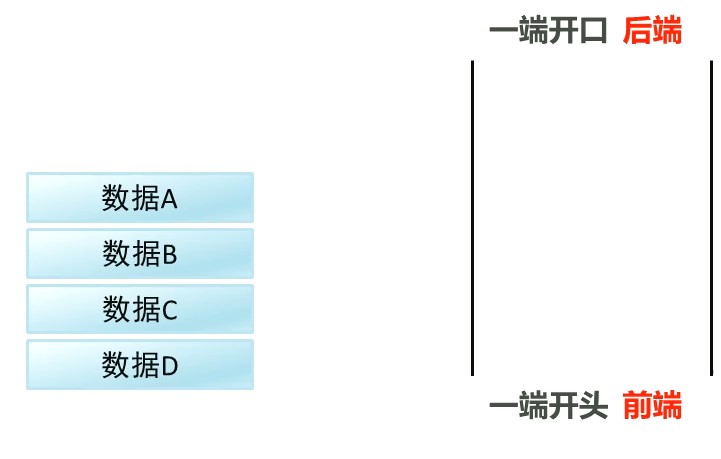

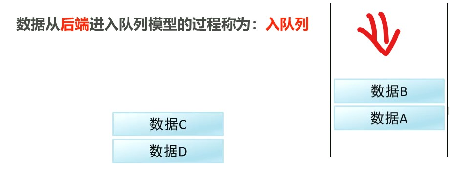

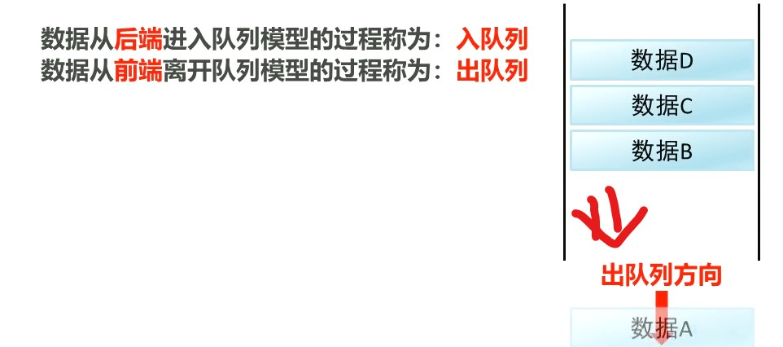

#### 2. 数组和链表

**数组**： 是查询快，增删慢的模型

- 通过索引查询定位，查询任意数据耗时相同，查询速度快

- 删除数据，要将原始数据删除，同时后面的每个元素向前移动，删除效率低

- 同样的，添加数据时，添加位置后的每个数据后移，再添加数据，添加效率低


**链表**：增删快，查询慢的模型（对比与数组）

- 查询每次都是要从头结点开始

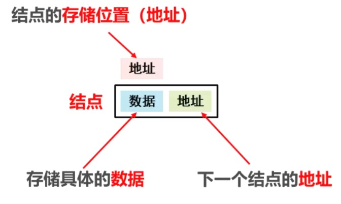

**链表的结点：**

1. 结点里面存储的： 数据和下一个节点的地址

2. 结点本身也是有地址的

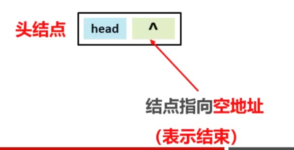


**a. 存储一个结点A，保存在地址11的位置**

- 把头结点里面存储的空地址改为结点A的地址即可[**就是A这个元素本身地址**]


**b. 再存储一个结点C，保存在地址37位置**

- 把结点A的空地址改为结点的地址即可

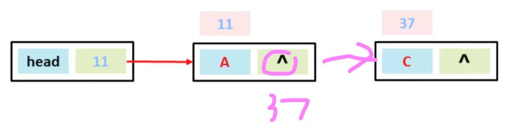


**c. 同理再存储一个结点D，保存在地址96的位置**

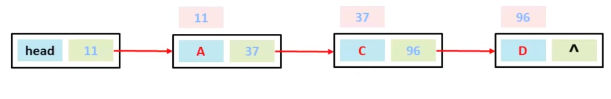


**d. 在结点AC之间添加一个结点B，保存在地址54位置**

	1. 结点B的里面存储的地址指向下一个结点C的地址
	2. 结点A的里面存储的地址指向结点B的地址

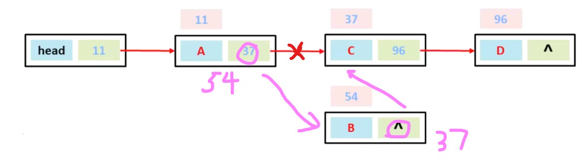


**e. 删除结点BD之间的结点C**

	1. 把结点B里面存储的地址改为结点D所在的地址即可
	2. 删除结点C

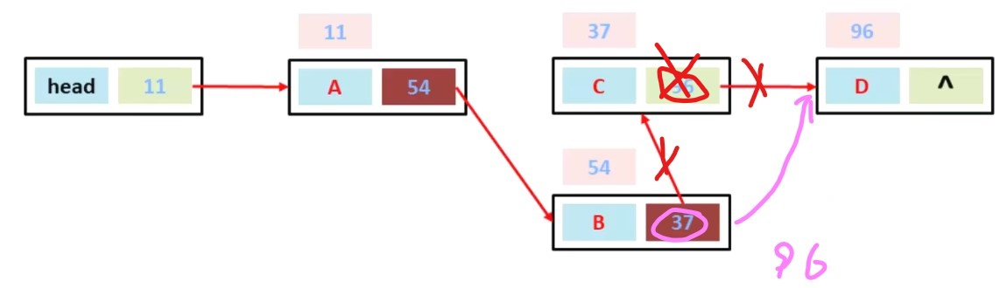


### 2.7 List集合子类特点

List集合常用子类：ArrayList，LinkedList

- ArrayList：底层数据结构时数组，查询快，增删慢
- LinkedList：底层数据结构是链表，查询慢，增删快

```java
//创建对象
ArrayList<String> arrayList = new ArrayList<String>();
arrayList.add("hello");
arrayList.add("world");
//遍历
for(String s:arrayList){
    System.out.println(s);
}

LinkedList<String> linkedList = new LinkedList<String>();
linkedList.add("hello");
linkedList.add("world");
for(String s:linkedList){
    System.out.println(s);
}
```

## 3. Set🍟

### 3.1 Set集合的特点

- **不包含重复元素的集合**

- **没有带索引的方法，所以不能使用普通的for循环遍历，可以使用迭代器和增强的for循环**
- **HashSet对集合的迭代顺序不作任何保证**

```java
//创建集合对象
// Set是一个接口不能直接实例化
// HashSet实现了Set接口
// HashSet对集合的迭代顺序不作任何保证
Set<String> set = new HashSet<String>();
set.add("hello");
set.add("world");
set.add("java");
//set集合不包含重复元素
set.add("hello");
Iterator<String> it = set.iterator();
while(it.hasNext()){
    String s = it.next();
    System.out.println(s);
}
System.out.println("--------");
for(String s:set){
    System.out.println(s);
}
```

> world
> java
> hello
>
> --------
>
> world
> java
> hello

### 3.2 哈希值

是JDK根据 对象的地址 或者 字符串 或者 数字 算出来的**int类型的数值**

Object类有一个方法可以获取 **对象的哈希值**

```java
public int hashCode();//返回对象的哈希值
```

对象的哈希值特点：

- 同一个对象多次调用hashCode()方法返回的哈希值是相同的
- 默认情况下，不同对象的哈希值是不同的，但是可以重写hashCode()方法，实现不同对象返回的哈希值相同

```java
//重写hashCode方法
@Override
public int hashCode(){
    return 0;
}
```

```java
Student s1 = new Student("Jerry", 11);
Student s2 = new Student("Mark", 12);
//同一个对象多次调用hashCode()方法返回的哈希值是一样的
System.out.println(s1.hashCode());//1239731077
System.out.println(s1.hashCode());//1239731077
//默认情况下，不同对象的哈希值是不同的
System.out.println(s2.hashCode());//557041912
//通过方法重写，可以实现不同对象的哈希值是相同的

System.out.println("hello".hashCode());//99162322
System.out.println("world".hashCode());//113318802

System.out.println("重地".hashCode());//1179395
System.out.println("通话".hashCode());//1179395
System.out.println("你好".hashCode());//652829
System.out.println("明天".hashCode());//832731
System.out.println("啊".hashCode());//21834
```


### 3.3 HashSet集合概述和特点

- 底层数据结构是哈希表
- 对集合的迭代顺序不做保证，也就是元素的存储和取出的顺序不一定一致
- 没有带索引的方法，所以不能用普通的for循环遍历，可以用迭代器和增强for循环
- 由于是Set集合，不包含重复元素

```java
HashSet<String> hashSet = new HashSet<String>();
hashSet.add("hello");
hashSet.add("world");
hashSet.add("java");
hashSet.add("hello");

for(String s:hashSet){
    System.out.println(s);
}
```

>world
>java
>hello

### 3.4 HashSet集合保证元素唯一性的源码分析

### 3.5 常见数据结构之哈希表

哈希表：底层采用了**数组＋链表**实现，可以说是一个元素为链表的数组

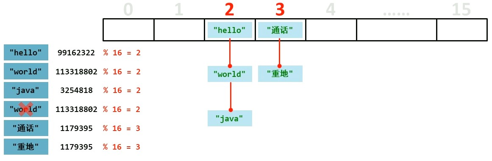


### 3.6 HashSet集合存储学生对象并遍历

```java
HashSet<Student> hashSet = new HashSet<Student>();

Student s1 = new Student("Jerry", 11);
Student s2 = new Student("mark", 12);
Student s3 = new Student("Jerry", 11);

hashSet.add(s1);
hashSet.add(s2);
hashSet.add(s3);//需要重写equals()和hashCode()方法

for(Student s:hashSet){
    System.out.println(s.getAge()+ " " + s.getName());
}
```

### 3.7 LinkedHashSet集合概述和特点

- 哈希表和链表实现的Set接口，有次序
- 由链表保证元素有序，也就是说元素的存储和取出的顺序一致
- 由哈希表保证元素的唯一，也就是说没有重复的元素

```java
LinkedHashSet<String> linkedHashSet = new LinkedHashSet<String>();

linkedHashSet.add("hello");
linkedHashSet.add("world");
linkedHashSet.add("java");
linkedHashSet.add("hello");

for(String s:linkedHashSet){
    System.out.println(s);
}

Iterator<String> it = linkedHashSet.iterator();
while(it.hasNext()){
    String s = it.next();
    System.out.println(s);
}
```

### 3.8 TreeSet集合概述和特点

- 元素有序，这里的顺序不是指存储和取出的顺序，而是按照一定的规则进行排序，具体的排序方法取决于构造方法
  - TreeSet()：根据元素的**自然排序**就行排序
  - TreeSet(Comparator comparator)：根据给定的比较器进行排序
- 因为没有带索引的方法，所以不能用普通的for循环遍历

- 由于是Set集合，也不包含重复的元素

```java
TreeSet<String> strings = new TreeSet<String>();
strings.add("hello");
strings.add("world");
strings.add("java");
strings.add("hello");

for(String s:strings){
    System.out.println(s);
}

//集合里只能存储引用的类型，这里存储的是整数，只能用int的包装类类型
TreeSet<Integer> ints = new TreeSet<Integer>();
ints.add(19);
ints.add(12);
ints.add(8);
ints.add(32);
Iterator<Integer> it = ints.iterator();
while(it.hasNext()){
    int i = it.next();
    System.out.println(i);
}
```

> hello
> java
> world
> 8
> 12
> 19
> 32

### 3.9 Comparable 自然排序

- 用TreeSet集合存储自定义对象，**无参构造**方法使用的是**自然排序**对元素进行排序的
- 自然排序，就是让**元素所属的类**实现Comparable接口，然后重写 compareTo(T o)方法
- 重写方法时候，排序要求必须要按照要求的主要条件和次要条件来写

```java
public class Student implements Comparable<Student>{
    @Override
    public int compareTo(Student s) {
        //return 0;//不存储
        //return 1;//如果返回是正数，按添加顺序 正序存储
        //return -1;//如果返回是负数，按添加顺序 倒序存储
        //int n = s.age = this.age; //按照年龄 从大到小排序
        int n = this.age - s.age;   //按照年龄 从小大大排序
        int n1 = n == 0 ? this.name.compareTo(s.name) : n; //年龄一样，比较名字，按字母排序
        return n1;
    }
}

==============================================================================================
//按照年龄从小到大排序，年龄相同时，按照姓名的字母顺序排序	    
TreeSet<Student> students = new TreeSet<Student>();
Student s1 = new Student("Mark", 12);
Student s2 = new Student("Jerry", 10);
Student s3 = new Student("Lorry", 15);
Student s4 = new Student("Tony", 11);

Student s5 = new Student("Pit", 11);

students.add(s1);
students.add(s2);
students.add(s3);
students.add(s4);
students.add(s5);

for(Student s: students){
    System.out.println(s.getName() + ": " + s.getAge());
}
```

> Jerry: 10
> Pit: 11
> Tony: 11
> Mark: 12
> Lorry: 15


### 3.10 比较器 Comparator的使用

- 用TreeSet集合存储自定义对象，带参构造方法使用的是**比较器排序**对元素进行排序的
- 比较器排序，就是让集合**构造方法接收Comparator的实现类对象，重写compare(T t1, T t2)方法**
- 重写方法时候，排序要求必须要按照要求的主要条件和次要条件来写

```java
TreeSet<Student> students = new TreeSet<Student>(new Comparator<Student>() {
    @Override
    public int compare(Student s1, Student s2) {
        int n1 = s1.getAge() - s2.getAge();
        int n2 = n1 == 0 ? s1.getName().compareTo(s2.getName()) : n1;
        return n2;
    }
});
```


### 3.11 不重复的随机数

```java
/*
    获取10个 1-20之间的随机数，要求随机数不能重复。并输出
    1. 创建Set集合对象
    2. 创建随机数对象 1-20之间的
    3. 判断集合长度是否小于10
        是： 产生一个随机数，添加到集合
        否： 跳出循环
    4. 遍历集合
 */
Set<Integer> s = new HashSet<>();
//TreeSet<Integer> s = new TreeSet<>();//输出的随机数是排序的 也是不重复的
// 创建随机对象、
Random r = new Random();
while(s.size() < 10){
    int n = r.nextInt(20);
    s.add(n);
}
for(Integer i : s){
    System.out.println(i);
}
```

> 0
> 3
> 19
> 4
> 5
> 8
> 11
> 13
> 14
> 15

## 4. 泛型🌭


## 5. Map🍿


## 6. Collections🧂

