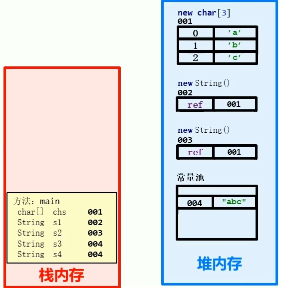
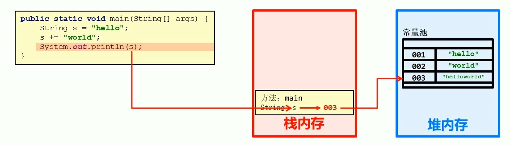

## 1. API
API Application Programming Interface 应用程序编程接口

Java API：JDK中提供的各种工能的Java类

**案例：**

```Java
import java.util.Scanner;


public static void main(String[] args) {
    //创建一个Scanner对象
    Scanner sc = new Scanner(System.in);
    //String st = sc.nextLine();
    //ctrl + alt + v 对象调用方法 返回左边的值
    System.out.println("请从键盘输入字符串: ");
    String s = sc.nextLine();
    System.out.println("输出为：" + s);
}
```

## 2. String

### 2.1 String的构造方法
|方法名|说明|
|--|--|
|public String()|创建一个空白字符串对象，不含任何内容|
|public String(char[] chs)|根据字符数组的内容来创建字符串对象
|public String(byte[] bys)|根据字节数组的内容来创建字符串对象|
|String s = "abc";|直接赋值的方式创建字符串对象，内容就是"abc"|

案例：
```Java
//1.
String s1 = new String();
System.out.println("s1: " + s1);
//2
char[] arr = {'a', 'b', 'c'};
String s2 = new String(arr);
System.out.println("s2: " + s2);
//3
byte[] bys = {97, 98, 99};
String s3 = new String(bys);
System.out.println("s3: " + s3);
//4
String s4 = "abc";
System.out.println("s4: " + s4);
```

### 2.2 String的特点
```Java
char[] chs = {'a', 'b', 'c'};
String s1 = new String(chs);
String s2 = new String(chs);
//比较字符串的地址是否相同
System.out.println(s1 == s2);

String s3 = "123";
String s4 = "123";
System.out.println(s3 == s4);
System.out.println(s1 == s3);

int a1 = System.identityHashCode(s1);
int a2 = System.identityHashCode(s2);
int a3 = System.identityHashCode(s3);
int a4 = System.identityHashCode(s4);
System.out.println("a1: " + a1);
System.out.println("a2: " + a2);
System.out.println("a3: " + a3);
System.out.println("a4: " + a4);
```
**结果：**
>false
true
false
a1: 2083562754
a2: 1239731077
a3: 557041912
a4: 557041912

**分析：**



**总结：**
1. 通过new创建的字符串对象，每一次new都会申请一个内存空间，虽然内容可能相同，但是地址不同
2. 以" " 方式给出的字符串，只要字符串序列相同(顺序和大小写都相同)，无论程序代码中出现了几次，JVM都只会建立一个String对象，并在字符串池中维护

### 2.3. 字符串的比较
使用**<font color = "brown">==</font>**做比较
- 基本类型： 比较的**数据值**是否相同
- 应用类型： 比较的**地址值**是否相同

字符串是通过 **equals()** 方法实现
```Java
boolean equals​(Object anObject)// 将此字符串与指定对象进行比较
```
```Java
String s1 = "12";
String s2 = "12";
String s3 = "123";

System.out.println(s1.equals(s2));
System.out.println(s1.equals(s3));
```

**案例：**

**1. 用户登录：**
已知用户名和密码，请用程序模拟用户登录。总共给三次机会，登录后，给出相应的提示

**思路：**
1. 已知用户名和密码，定义两个字符串表示
2. 键盘录入要登录的用户名和密码，用Scanner实现
3. 用键盘录入的用户名，密码和已知的用户名，密码比较，给出对应的提示。字符串比较用 equals()方法实现

```Java
public class MyString {
    public static void main(String[] args) {
        String username = "Jack";
        String password = "123456";
        Scanner sc = new Scanner(System.in);

        for(int i = 0; i < 3; i++) {

            System.out.println("输入用户名： ");
            String name = sc.nextLine();
            System.out.println("输入密码： ");
            String psw = sc.nextLine();

            if (name.equals(username) && password.equals(psw)) {
                System.out.println("登录成功");
                break;
            }
            else {
                if (2 - i == 0)
                    System.out.println("账户被锁定");
                else
                    System.out.println("输入有误，还有" + (2 - i) + "次机会");
            }
        }
    }
}
```

**2. 遍历字符串：**
键盘录入一个字符串，使用程序实现在控制台遍历该字符串
思路：
1. 键盘录入字符串， Scanner实现
2. 遍历字符串，获取字符串的每一个字符 charAt(int idx)
3. 获取字符串的长度， length()

```Java
Scanner sc = new Scanner(System.in);
System.out.println("请输入字符串：");
String str = sc.nextLine();

//遍历并在控制台显示
for(int i = 0; i < str.length(); i++){
    System.out.println(str.charAt(i));
}
```

**3. 统计字符次数：**
键盘录入一个字符串，统计该字符串中大写字母字符，小写字母字符，数子字符 出现的次数(不考虑其他字符)
思路：
1. 键盘录入一个字符串，用Scanner实现
2. 统计三种类型的字符个数，需要定义三个统计变量，初始值为0
3. 遍历字符串，得到每一个字符
4. 判断该字符串属于哪种类型，然后对应类型的统计变量+1
5. 输出三种类型字符的个数

判断字符是那种类型的方法：
直接判断该字符对应的ASCII范围
- 大写字母： ch >= 'A' && ch <= 'Z'
- 小写字母： ch >= 'a' && ch <= 'z'
- 数子：     ch >= '0' && ch <= '9'

```Java
int n1 = 0;
int n2 = 0;
int n3 = 0;
Scanner sc = new Scanner(System.in);
System.out.println("请输入字符串：");
String str = sc.nextLine();

//遍历并在控制台显示
for(int i = 0; i < str.length(); i++){
   char ch = str.charAt(i);
  if(ch >= 'A' && ch <= 'Z')
      n1++;
  else if(ch >= 'a' && ch <= 'z')
      n2++;
  else if(ch >= '0' && ch <= '9')
      n3++;
}
System.out.println("大写字母个数：" + n1);
System.out.println("小写字母个数：" + n2);
System.out.println("数子个数：" + n3);
```

**4. 拼接字符串：**
定义一个方法，把int数组中的数据按照指定的格式拼接成一个字符串返回，调用该方法并在控制台输出。例如： 数组为int[] arr = {1, 2, 3};, 执行方法后输出的结果为：[1, 2, 3]

思路：
1. 定义一个int类型的数组，用静态初始化完成数组元素的初始化
2. 定义一个方法，用于把int数组中的数据按照指定格式拼接成一个字符串返回。返回值为String，形参为 int[] arr
3. 在方法中遍历数组并按要求进行拼接
4. 调用方法，输出结果

```Java
public static String arryToString(int[] arr){
    String str = "";
    str += "[";
    for(int i = 0; i < arr.length; i++)
    {
        if(i == arr.length -1)
            str += arr[i];
        else
            str += arr[i] + ", ";
    }
    str += "]";
    return str;
}
```

**字符串反转：**
定义一个方法，实现字符串反转。键盘录入一个字符串，调用该方法后，在控制台输出结果。比如： 键盘录入 abc，输出cba

思路：
1. 键盘录入一个字符串
2. 定义一个实现字符串反转的方法。返回值类型为 String，形参为String s
3. 在方法中把字符串倒着遍历，然后把得到的字符拼接成一个字符串并返回
4. 调用方法，输出结果

```Java
public static String reverseString(String str)
{
    String s = "";
    for(int i = 0; i < str.length(); i++){
        s += str.charAt(str.length() - 1 - i);
    }
    return s;
}
```

## 3. StringBuilder


如果对字符串进行拼接操作，每次拼接都会构建一个新的String对象，既耗时又浪费内存空间，而这种操作又是不可避免的。Java提供了**StringBuilder**类来解决这个问题

**StringBuilder概述：**
是一个可变的字符串类，可以把他看成一个容器。这里可变的指StringBuilder对象中的内容是可变的

**String和StringBuilder区别：**
- String：内容是不可变的
- StringBuilder：内容是不可变的

### 3.1 StringBuilder的构造方法
|方法名|说明|
|--|--|
|StringBuilder()|创建一个空白可变的字符串对象|
|StringBuilder(String str)|根据字符串的内容，来创建可变字符串对象|

**StringBuilder的添加和反转方法**

|方法名|说明|
|--|--|
|StringBuilder append(任意类型)|添加数据，并返回对象本身|
|StringBuilder reverse()|返回相反的字符序列|

链式编程：
```Java
StringBuilder str = new StringBuilder();
str.append("hello ").append("world ").append("java");
```
案例：拼接字符串（升级版）
定义一个方法，把int数组总的数据按照指定格式拼接成一个字符窜返回，调用该方法在控制台输出。例如：数组int[] arr = {1, 2, 3};, 执行该方法输出结果为：[1,2,3]

```Java
public static String arryToString(int[] arr){
    StringBuilder strB = new StringBuilder();
    strB.append("[");
    for(int i = 0; i < arr.length; i++){
        if(i == arr.length - 1)
            strB.append(arr[i]);
        else
            strB.append(arr[i]).append(", ");
    }
    strB.append("]");
    String s = strB.toString();
    return  s;
}
```

### 3.2 StringBuilder和String相互转换
1. StringBuilder转为String
public String toString();通过toString()方法就可以把StingBuilder转为String了

2. String转为StringBuilder
public StringBuilder(String s);通过构造方法把String转为StringBuilder

案例： 字符串反转（升级版）
定义一个方法，实现字符串反转。键盘录入一个字符串，调用该方法后，在控制台输出结果。比如： 键盘录入 abc，输出cba

```Java
public static String reverseString(String s)
{
    StringBuilder strB = new StringBuilder(s);
    strB.reverse();
    String output = strB.toString();
    return output;
    //return new StringBuilder(s).reverse().toString();
}
```
