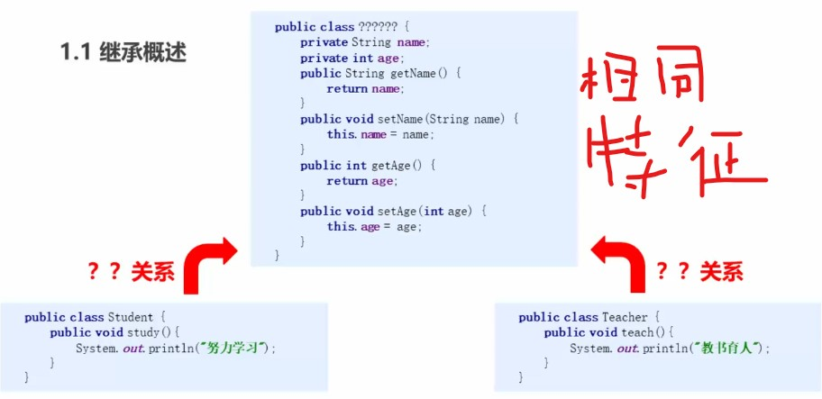

## 1. 继承




继承概述： 是面向对象的三大特征之一，让子类具有父类的属性和方法，还可以在子类中重新定义，追加属性和方法

格式：
```java
public class 子类名 extends 父类名{}
```
```java
public class Son extends Father{}
```

**什么时候使用继承：**
- 继承体现的关系：is a

- 假设法：我有两个类A和B,如果他们满足A是B的一种,或者B是A的一种，就说明他们存在继承关系，这个时候考虑使用继承来体现，否则不能滥用继承

例如：苹果和水果， 猫和动物， 猫和狗(不是)

### 1.1 继承中的访问特点
在子类中访问一个变量或者成员方法
- 在子类局部范围内找（调用变量的方法内）

- 在子类的成员范围找

- 在父类成员范围找

- 如果没有就报错

```java
public class Father {
    int age = 30;
}
```
```java
public class Son extends Father{
    int height = 170;
    int age = 18;
    public void show(){
        int age = 20;
        System.out.println(age);
        System.out.println(height);
    }
}
```
```java
public class Son extends Father{

    public void method(){
        System.out.println("子类的method方法被调用");
    }
    public void show(){      
        super.show();//调用父类的成员方法
        System.out.println("子类的show方法被调用");
    }
}
```

### 1.2 super关键字

**super**关键字的用法和**this**关键字用法相似
- this：代表本类对象的引用
- super：代表父类对象的引用
|关键字|访问成员变量|访问构造方法|访问成员方法|
|--|--|--|--|
|this|this.成员变量 访问本类成员变量|this(...) 访问本类构造方法|this.成员方法(...)访问本类成员方法|
|super|super.成员变量 访问父类成员变量|super(...) 访问父类构造方法|super.成员方法(...)访问父类成员方法|


### 1.3 继承中构造方法的访问特点
调用子类中的**有参构造方法** 调用的是父类中的**<font color = "yellow">无参构造方法</font>?**

- 因为子类继承父类中的数据，可能还会使用父类的数据。所以子类初始化之前，一定要先初始化父类（没有父亲怎么会有儿子呢?)
- 每个子类构造方法的第一句语句默认都是：**super()**

如果父类中没有无参构造方法，只有有参构造方法
- 通过**super**关键字显示调用父类的带参构造方法
- **<font color = "purple">在父类中自己提供一个无参构造方法</font>**

```java
public class Father {
//    Father(){
//        System.out.println("父类无参构造");
//    }
    //自己提供一个默认的无参构造方法
    public Father(){}
    public Father(int age){
        System.out.println("父类有参构造");
    }
}
```
```java
public class Son extends Father{
    public Son(){
        //当父类没有无参构造方法时候，通过super显示调用父类的构造方法
        //super();//子类默认的
        //通过super调用父类的有参构造方法
        //super(20)
        System.out.println("子类无参构造");
    }
    public Son(int age){
        //super();
        System.out.println("子类有参构造");
    }
}
```

### 1.4 方法重写

**概念：**
- 子类中出现了和父类一样的方法声明

**方法重写的应用：**
- 当子类需要父类的功能，而子类还有自己特有的内容时候，可以重写父类中的方法，这样既可以使用父类中的功能，又定义了子类特有的内容


```java
@Override
```
- 注解

- 帮助检查重写方法的方法声明的正确性

**举例：**

```java
public class Phone {
    public void call(String name){
        System.out.println("给" + name + "打电话");
    }
}
```
```java
public class NewPhone extends Phone{
    @Override
    public void call(String name) {
        //子类的特有功能
        System.out.println("打开视频");
        //父类的功能
        super.call(name);
    }
}
```

**注意事项：**


1. 父类中的私有成员方法子类是继承不到的，所以不能重写父类的私有成员方法

2. 子类的访问权限不能比父类的低（**<font color = "yellow">public > 默认 > private</font>**)

### 1.5 继承的注意事项
1. Java类只支持单继承，不支持多继承
```Java
//会报错 不能继承多个父类
public class Son extends Father, Mother{
}
```

2. Java类支持多层继承
```Java
public class Grandfa {
    public void read(){
        System.out.println("祖父爱看书");
    }
}
```
```Java
//Father类继承Grandfa类
public class Father extends Grandfa{
    public void ride(){
        System.out.println("父亲骑车");
    }
}
```
```Java
public class Son extends Father{
    public void study(){
        System.out.println("儿子爱学习");
    }
}
```
```Java
public static void main(String[] args) {
    Son s = new Son();
    //可以调用父类和父类的父类中的成员方法
    s.study();
    s.ride();
    s.read();
}
```
>儿子爱学习
父亲骑车
祖父爱看书

## 2.案例
### 2.1 老师和学生
定义老师和学生类，然后代码测试
最后找到老师类和学生类的共性内容，
抽取出构造一个父类，用继承的方式改写代码，并代码测试
```Java
//Person类
public class Person {
    public int age;
    public String name;

    public Person() {
    }

    public Person(int age, String name) {
        this.age = age;
        this.name = name;
    }

    public int getAge() {
        return age;
    }

    public void setAge(int age) {
        this.age = age;
    }

    public String getName() {
        return name;
    }

    public void setName(String name) {
        this.name = name;
    }

    public void show(){
        System.out.println("name: " + name + "  age:  " + age);
    }
}
```
```Java
//教师类
public class Teacher extends Person{
    //手动添加无参构造
    public Teacher() {
    }

    public Teacher(int age, String name){
        //因为父类的成员为私有变量，使用this是访问不到的
        //this.age = age;
        super(age, name);
    }

    public void teach(){
        System.out.println("老师教书");
    }
}
```
```Java
//学生类
public class Student extends Person{

    public void study(){
        System.out.println("学生学习");
    }
}
```

```Java
public class TestDemo {
    public static void main(String[] args) {
        //无参构造
        Teacher t = new Teacher();
        t.setAge(30);
        t.setName("Marry");
        t.teach();
        t.show();
        //有参构造
        //调用有参构造时候，需要自己在子类中写
        Teacher t1 = new Teacher(34, "Rose");
        t1.show();

        Student s = new Student();
        s.setAge(13);
        s.setName("Mark");
        s.study();
        s.show();
    }
}
```
