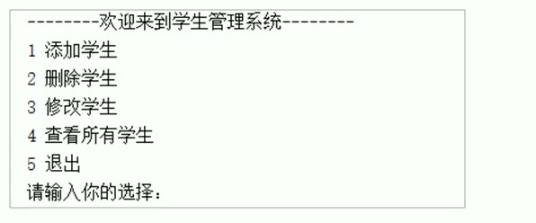
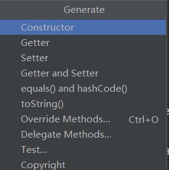
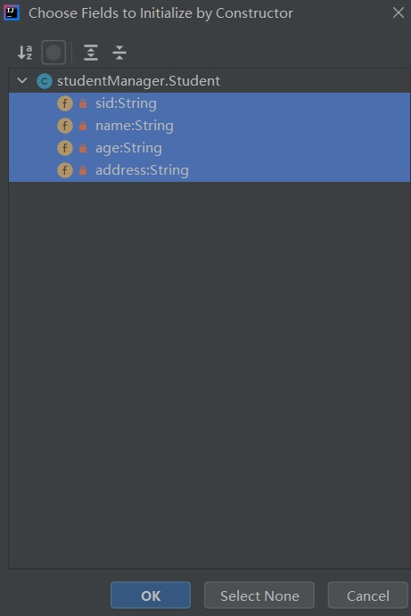

## 1. 集合基础
概述：是一种存储空间可变的存储模型，存储的**数据容量**可以发生改变
```java
ArryList<E>
```
- 是可以调整大小的**数组**
- E：泛型，是一种特殊的数据类型

E使用应用数据类型替代即可
举例：
```java
ArrayList<String>,
ArrayList<Student>
```

### 1.1 ArrayList构造方法和添加方法
|方法名|说明|
|--|--|
|ArrayList()|创建一个空的集合对象|
|boolean add(E e)|将指定的元素添加到该集合的末尾|
|add(int idx, E element)|在集合指定位置插入指定的元素|

```java
//创建String类型的数组
ArrayList<String> arrList = new ArrayList<>();
//末尾添加元素
arrList.add("Hello");
arrList.add("World");
arrList.add("java");
System.out.println(arrList);
//任意位置添加元素,注意不能越界
arrList.add(1, "Git");
System.out.println(arrList);
```
[Hello, World, java]
[Hello, Git, World, java]

### 1.2 ArrayList常用方法
|方法名|说明|
|--|--|
|boolean remove(Object o)|删除指定元素，并返回删除时候成功|
|E remove(int idx)|删除指定索引元素，返回被删除的元素|
|E set(int idx, E element)|修改指定索引的元素，返回被修改的元素|
|E get(int idx)|返回指定索引的元素|
|int size()|返回集合中元素的个数|

```java
//创建String类型的数组
        ArrayList<String> arrList = new ArrayList<>();
        //末尾添加元素
        arrList.add("Hello");
        arrList.add("World");
        arrList.add("java");
        arrList.add("is");
        arrList.add("the");
        System.out.println(arrList);
        //删除指定元素，返回是否成功删除
        boolean f = arrList.remove("Hello");
        System.out.println("boolean: " + f);
        System.out.println(arrList);
        //删除指定索引的元素，返回被删除的索引
        String arrRemove = arrList.remove(2);
        System.out.println("arrRemove: " + arrRemove);
        System.out.println(arrList);
        //修改指定索引的元素
        String arrSet = arrList.set(2, "C++");
        System.out.println("arrSet:"  + arrSet);
        System.out.println(arrList);
        //获取指定索引上的元素，并返回该元素
        String arrGet = arrList.get(1);
        System.out.println("arrGet: " + arrGet);
        int size = arrList.size();
        System.out.println("size: "+ size);
```
>[Hello, World, java, is, the]
boolean: true
[World, java, is, the]
arrRemove: is
[World, java, the]
arrSet:the
[World, java, C++]
arrGet: java
size: 3

## 2. 案例 1

案例： 存储学生对象并遍历
创建一个存储学生对象的集合，存储3个学生，使用程序实现在控制台遍历该集合
通过键盘录入学生姓名和年龄

思路：
1. 定义学生类，为了便于键盘录入数据，把学生类中的成员变量定义为String类型
2. 创建集合对象
3. 创建学生对象 ，键盘录入学生信息赋值给对象的成员变量
4. 集合中添加学生对象
5. 遍历集合，输出结果

```java
public static void main(String[] args) {
        ArrayList<Student> arr = new ArrayList<>();
        addStudent(arr);
        addStudent(arr);
        addStudent(arr);
        showArr(arr);
}
//添加元素到集合
public static void addStudent(ArrayList<Student> arrList ){
    //键盘录入姓名和年龄
    Scanner sc = new Scanner(System.in);
    System.out.println("输入姓名：");
    String name = sc.nextLine();
    System.out.println("输入年龄：");
    String age = sc.nextLine();
    //创建学生对象，并赋值
    Student s = new Student();
    s.setAge(age);
    s.setName(name);
    //添加学生到集合中
    arrList.add(s);
}
//遍历集合元素的信息
public static void showArr(ArrayList<Student> arr){
    for(int i = 0; i < arr.size(); i++){
        arr.get(i).showStudent();
    }
}
```
## 3. 案例2 学生管理系统

### 3.1 思路
1. 定义学生类
2. 主界面代码编写
3. 添加学生代码编写
4. 查看学生代码编写
5. 删除学生代码编写
6. 修改学生代码编写

### 3.2 定义学生类
学生类：
- Student

成员变量：
- 学号：sid
- 姓名：name
- 年龄：age
- 居住地：address

构造方法：
- 无参构造
- 有参构造（带成员属性的4个参数)

成员方法：
- 每个成员变量给出get/set方法

**快捷键：**
**alt + insert** 可以选择自动生成构造方法和成员变量的设置方法



**shift + 左键**可以进行多选



```java
public class Student {
    //学号，姓名，年龄，地址
    private String sid;
    private String name;
    private String age;
    private String address;
    //无参和有参的构造方法
    public Student() {
    }
    public Student(String sid, String name, String age, String address) {
        this.sid = sid;
        this.name = name;
        this.age = age;
        this.address = address;
    }

    //成员方法的赋值和显示
    public String getSid() {
        return sid;
    }

    public void setSid(String sid) {
        this.sid = sid;
    }

    public String getName() {
        return name;
    }

    public void setName(String name) {
        this.name = name;
    }

    public String getAge() {
        return age;
    }

    public void setAge(String age) {
        this.age = age;
    }

    public String getAddress() {
        return address;
    }

    public void setAddress(String address) {
        this.address = address;
    }
}
```
### 3.3 主界面编写
**思路：**

1. 用输出语句完成主界面的编写

2. Scanner实现从键盘录入信息

3. switch语句完成操作的选择

4. 使用循环再次回到主界面

```java
while(true){}
System.exit(0);//JVM退出
```
### 3.4 添加学生
**思路：**
1. 键盘录入后选择添加学生

2. 定义一个方法，用于添加学生
  2.1 显示信息，提示要输入何种信息
  2.2 键盘录入学生对象所需要的信息
  2.3 创建学生对象，将信息赋值给该对象成员变量
  2.4 将学生对象添加到集合中保存
  2.5 提示添加成功的提示

### 3.5 查看学生
**思路：**
1. 键盘录入所要查看的学生

2. 定义方法，查看学生信息
  2.1 显示表头信息
  2.2 将集合中数据提取出按照格式显示，年龄补充 “岁”

3. 调用方法
