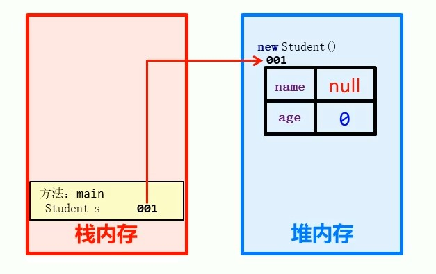
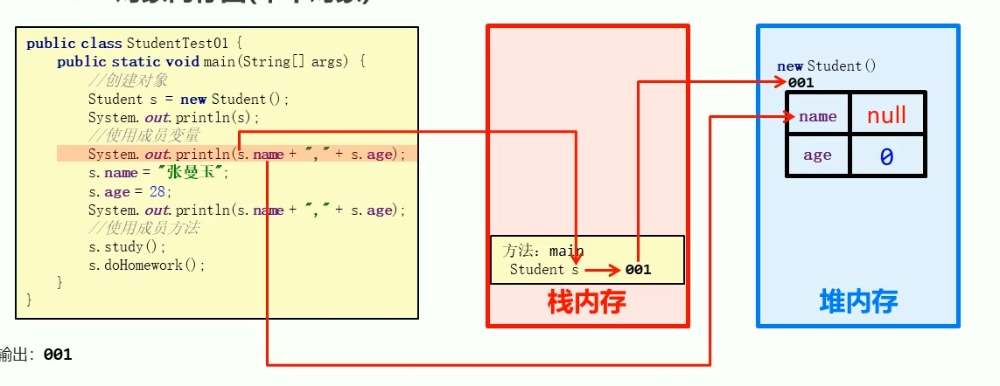
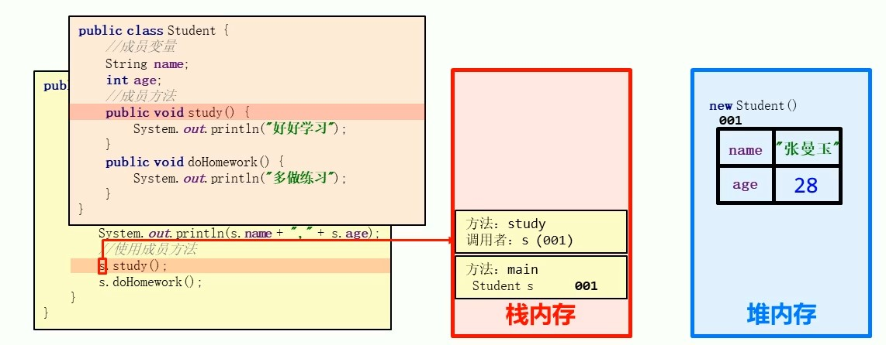
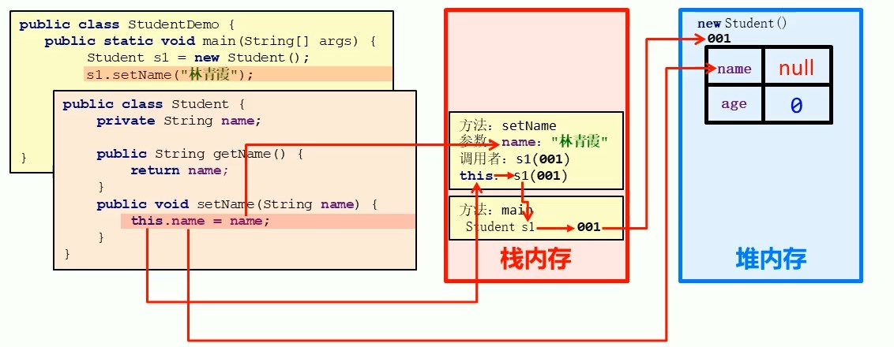

## 类和对象
万物皆可对象，客观存在的事物皆为对象

类： 对现实生活中一类具有共同属性和行为的食物的抽象

类的组成：<font color = "red">属性</font>和<font color = "red">行为</font>
- 属性：在类中通过成员变量来体现
- 行为：在类中通过成员方法来体现

```java
public class类名{
  //成员变量

  //成员方法
}
```

### 1.对象的使用
1.创建对象：
格式：
```java
类名 对象名 = new 类名();
```

范例：
```java
Phone p = new Phone();
```

2.使用对象：

对象使用成员变量：
格式：
```java
对象名.变量名
```
范例：
```java
p.brand
```

对象使用成员方法：
格式：
```java
对象名.方法名();
```
范例：
```java
p.call();
```
String s 是要大写的


例子：
```java
public class PhoneDemo {
    //测试类必须有main方法
    public static void main(String[] args) {
        Phone p = new Phone();

        System.out.println(p.brand + ": " + p.price);
        p.price = 1000;
        p.brand = "Mi";
        System.out.println(p.brand + ": " + p.price);
        p.sendMessage();
        p.call();
    }
}
```


**案例**
定义一个学生类，再定义一个学生测试类，在测试类中通过对象完成对成员变量和成员方法的调用
成员变量：姓名，年龄
成员方法：学习，做作业
```java
//学生类
public class Student {
    String name;
    int age;

    public void doHomework()
    {
        System.out.println("写作业");
    }
    public void study()
    {
        System.out.println("学习");
    }
}
//学生类的调用
public static void main(String[] args) {
        Student s = new Student();

        s.name = "Jerry";
        s.age = 18;
        System.out.println("name: " + s.name);
        System.out.println("age: " + s.age);
        s.study();
        s.doHomework();
}
```

## 2.对象内存图
在堆内存创建成员变量
在栈中创建成员方法
对象名是对象在栈中的首地址 通过首地址调用堆中的数据








## 3.成员变量和局部变量
|区别|成员变量|局部变量|
|--|--|--|
|类中位置|类中的方法外|方法内|
|内存中存储位置|堆内存|栈内存|
|生命周期|随对象存在而存在，消失而消失|随方法的调用存在，方法调用结束就消失|
|初始化|有默认的初始化值|无默认初始化值，必须先定义后赋值，才能使用|

## 4.封装
### 4.1 private关键字
### 4.2 this关键字
```java
public class Student {
    String name;

    public void setName(String name)
    {
        name = name;//此处会覆盖掉成员变量的同名name
        this.name = name;
    }
}
```


因为这里同名了，方法里面的变量都是局部变量，所以也就是**局部变量name** 赋值给了局部变量的name
但是我们需要更改的是**成员变量的name**


**总结：**

1. this 修饰的是成员变量
- 方法的形参如果与成员变量同名，不带this修饰的变量指的是形参，而不是成员变量
- 方法的形参不与成员变量同名，不带this修饰的变量指的是成员变量

2. 什么时候使用this?
**<font color = "yellow">解决局部变量隐藏成员变量的问题</font>**

3. this代表的是所在类的对象引用
方法被哪个对象调用，this就代表哪个对象

#### 4.2.1this调用原理


相当于this指的就是调用该方法的对象的地址

### 4.3 封装
面向对象的三大特征： 封装，继承，多态

**原则：**
将类的某些信息隐藏在类内部，不允许外部程序直接访问，二十通过该类提供的方法来实现对隐藏的信息的操作和访问
>比如private的成员变量提供对应的getXXX()和setXXX()

**好处：**
1.通过控制对成员变量的操作，提高代码安全性
2.对代码的方法进行封装，提高代码复用性

### 4.4 构造方法
作用: 创建对象,并初始化
格式：
```java
public class 类名{
  修饰符 类名(参数){
    //
  }
}
```
范例：
```java
public class Student{
  String name;
  int age;
  public Student(){
    System.out.println("无参构造方法");
  }
  public Student(String name, int age){
    System.out.println("有参构造方法");
    this.name = name;
    this.age = age;
  }

}

public class StudentDemo(){
  public static void main(String[] args)
  {
    Student s = new Student();//构造方法
  }
}
```


**总结：**
- 如果没有定义构造方法，系统将给出一个默认的无参构造方法
- 如果定义了构造方法，系统将不提供默认的构造方法
- **<font color = "brown">如果定义带参数构造方法，还要使用无参构造方法，就必须自己写一个无参构造方法</font>**

**标准类的制作：**
1. 成员变量
- 使用private修饰
2. 构造方法
- 提供一个无参构造函数
- 提供一个带多个参数的构造方法
3. 成员方法
- 提供一个成员变量对应的setXXX()/getXXX()
- 提供一个显示对象信息的show()
4. 创建对象并为成员变量赋值的两种方法
- 无参构造方法创建对象后使用setXXX()赋值
- 使用带参数构造方法直接创建带有属性值的对象
